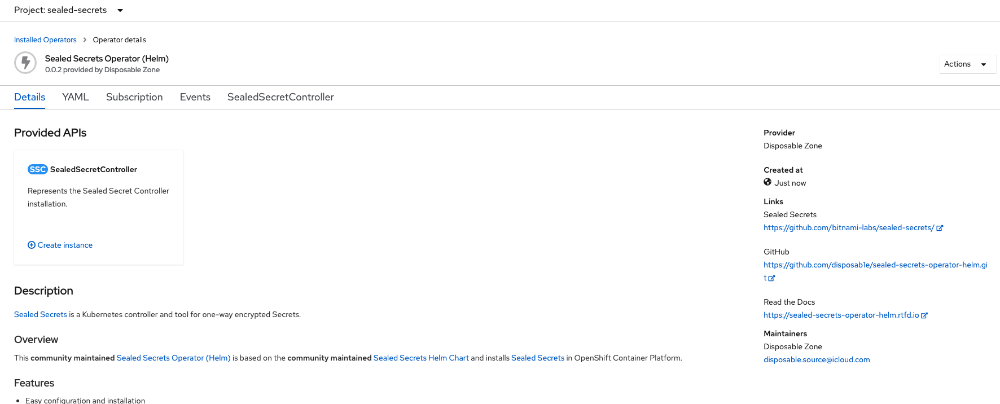

# Setup Instructions

Setup all the command line tools you need.  Download and install the following

<ul>
  <li>oc - openshift cmd line - download from openshift cluster. </li>
  <li>kam - cmd line for managing gitops repos - download from <a href=https://github.com/redhat-developer/kam/releases/tag/v0.0.40>https://github.com/redhat-developer/kam/releases/tag/v0.0.40</a> </li>
</ul>

Fork the following project on github - <a href="https://github.com/starnold-redhat/python-devfile">https://github.com/starnold-redhat/python-devfile</a>

## Overview

The setup can be viewed in a number of stages

* Install the required operators - pipelines, gitops and sealed-secrets
* Configure the selaed secrets operator
* Bootstrap the gitops process using kam to generate the gitops files
* Modify the pipeline to link the builds to deployments
* Create and configure a second environment


## Detailed instructions

1. **Install the Openshift GitOps, Openshift Pipelines, and Sealed Secrets operators with default values**
  
    * In the administrative view of the openshift console go to Operators->OperatorHub
    
      
    
    * Search for GitOps and you should see the following
     
      

    * Click on the tile to see the details
    
      
    
    * Click Install to get to the Install Operator page

      

    * Accept the defaults and click Install
    * Wait until you see Installed Operator - ready for use.
    * Now install the pipelines operator.  Go back to OperatorHub.
    * Search for pipelines - you should see this.

      

    * Click on the tile to get to the operator information page.

      

    * Click Install to get to the operator installation page.

      

    * Accept the defaults, and click Install.
    * Wait for the Operator to install.
    * Finally we need to install the sealed secrets operator.  So go back to OperatorHub, and search for secrets.

      

    * Click on the tile to open up the operator information page (hit continue if prompted with a warning about community operators).

      

    * Click on Install to get to the installation page.

      

    * Accept the defaults and click on Install.  Wait until the operator is installed.
    * Great - all the operators are now installed.
  
2. **Create an instance of the sealed-secrets operator**
    * Click on the Installed Operators menu item.   You should see a list of operators like this.

      

    * Click on the sealed secrets operator.  You should see this

      

    * Click on Create instance on the SealedSecretController tilee
    * Change the name to sealed-secrets-controller

      

    * Click Create.
    * Wait until the Status is Deployed as below.

      

    * The sealed secrets controller is now installed.

3. **Use kam to bootstrap the gitops files.**  To do that we're going to need to generate a git access token, and generate the docker cfg.
    * First thing is to generate the git access token, so that Openshft GitOps can access the code and gitops repositories.  Got to github and login.  Click on your avatar in the top right.

      

    * Choose settings, and then choose Developer settings.

      

    * Click on Personal access tokens

      

    * Click on Generate new token, and then provide your login credentials when prompted.
    * On the New personal access token screen, write a note for the token, and give it access to the repo.

      

    * Click generate token.  Make a note of the generated token, as you cannot see it again.
    * Next we need to generate the docker cfg json to access internal openshift repo. Login to the cluster with `oc login`
    * Login to the registry with `oc registry login`
    * Check you have a new file at ~/.docker/config.json
    * Use kam to bootstrap the gitops files.  Copy and then modify the following kam command from the command line, replacing the access token, gitops url (with the url to a new github project), service-repo-url (with the one cloned at the beginning), gitops-webhook-secret and service-webhook-secret (with any text you like).

    ```
    kam bootstrap --git-host-access-token xxxxxxxxxxxxxxxxxxxxxxxxxxxxxxxxxxx
                  --gitops-repo-url https://github.com/starnold-redhat/python-demo-gitops.git 
                  --gitops-webhook-secret kam-gitops-secret123! 
                  --push-to-git 
                  --sealed-secrets-ns sealed-secrets 
                  --sealed-secrets-svc sealed-secrets-controller 
                  --service-repo-url https://github.com/starnold-redhat/python-devfile.git 
                  --service-webhook-secret kam-gitops-secret123!
    ```
    
    * Now modify the deployment files for the app to pick up the generated image from the pipeline [TODO]
    
4. **Setup the pipeline.** - The thing that is missing from the pipeline, is the automatic link between building a new image on a code change, and letting Openshift GitOps know about it.  So to fix this we need to add a new task, which updates the gitops repository with the new image tag whenever a pipeline runs. 
    
    * Before we create tne new task, we need an image with both the git command line and kustomize installed.  I've built one already - and you can just copy it into your cluster as follows.

    ```
    oc new-project cicd
    oc import-image cicd/kustomize:1 --from=quay.io/starnold/pipeline-kustomize:2 --confirm
    ```

    * Now create a new task in the gitops/config/cicd/base/04-tasks folder.  Name the new task update-image-tag.yaml, and populate it with these contents.  

    ```
    apiVersion: tekton.dev/v1beta1
    kind: Task
    metadata:
      name: update-image-tag
      namespace: cicd
    spec:
      params:
      - name: OPS_GIT_REPO
        type: string
        default: 'starnold-redhat/python-gitops.git'
      - name: OPS_GIT_NAME
        type: string
        default: 'python-gitops'
      - name: GIT_USER_NAME
        type: string
        default: 'starnold-redhat'
      - name: GIT_USER_EMAIL
        type: string
        default: 'starnold@redhat.com'
      - name: SRC_GIT_NAME
        type: string
        default: 'app-python-devfile'
      - name: DESCRIPTION
        type: string
      - name: IMAGE
        type: string
      - name: BUILDER_IMAGE
        default: image-registry.openshift-image-registry.svc:5000/cicd/kustomize:1
        description: The location of the buildah builder image.
        type: string

      steps:
      - image: $(params.BUILDER_IMAGE)
        name: update-ops-repo-with-imagetag
        env:
          - name: GITHOSTACCESSTOKEN
            valueFrom:
              secretKeyRef:
                key: "token"
                name: "git-host-access-token"
        resources: {}
        script: >
          #!/bin/sh

          cd /workspace/source/

          git config --global user.email "${GIT_USER_EMAIL}"

          git config --global user.name "${GIT_USER_NAME}"

          mkdir localgitops

          cd localgitops

          git clone https://${GITHOSTACCESSTOKEN}@github.com/$(params.OPS_GIT_REPO)

          # set image for dev deployment

          cd /workspace/source/localgitops/$(params.OPS_GIT_NAME)/environments/dev/apps/$(params.SRC_GIT_NAME)/services/python-devfile/base/config

          kustomize edit set image $(params.IMAGE)

          # set image for stage deployment

          cd /workspace/source/localgitops/$(params.OPS_GIT_NAME)/environments/stage/apps/$(params.SRC_GIT_NAME)/services/python-devfile/base/config

          kustomize edit set image $(params.IMAGE)

          # Push back to git

          cd /workspace/source/localgitops/$(params.OPS_GIT_NAME)

          git add .

          git commit -m "$(params.DESCRIPTION)"

          git push -u origin HEAD:main
      workspaces:
        - name: source

    ```

    * Modify the task to use your git user name and git email as the default values ( or modify the pipeline in the next step to pass these values in)
    * Go to the 05-pipelines folder, and open up the app-ci-pipeline.yaml
    * After the build image task, add the following task definition to the pipeline (changing the gitops repo value).

    ```
    - name: update-ops-repo
      params:
      - name: OPS_GIT_REPO
        value: "https://github.com/starnold-redhat/python-gitops.git"
      - name: OPS_GIT_NAME
        value: 'python-gitops'
      - name: GIT_USER_NAME
        value: 'starnold-redhat'
      - name: GIT_USER_EMAIL
        value: 'starnold@redhat.com'
      - name: SRC_GIT_NAME
        value: 'app-python-devfile'
      - name: DESCRIPTION
        value: $(params.COMMIT_MESSAGE)
      - name: IMAGE
        value: $(params.IMAGE)
      runAfter:
      - build-image
      taskRef:
        kind: Task
        name: update-image-tag
      workspaces:
      - name: source
        workspace: shared-data
    ```

    Now you need to include the new task so it gets created by argo.  To do this, navigate to config/cicd/base.  Edit the kustomzation.yaml file, and add in the new task by including `- 04-tasks/update-image-tag.yaml` in the resources section.  It should look a bit like this.
    
    ```
    - 03-secrets/gitops-webhook-secret.yaml
    - 03-secrets/webhook-secret-dev-python-devfile.yaml
    - 04-tasks/update-image-tag.yaml
    - 04-tasks/deploy-from-source-task.yaml
    - 04-tasks/set-commit-status-task.yaml
    ```
    
    

    * Push these changes back to github with

    ```
    git add .
    git commit -m "updated pipelines"
    git push -u origin main
    ```
    
    

    * Great - you've now finished the pipelines.


5. **Setup the argo cd.** 

Probably make the gitops project public - as its a bit easier.  Otherwise you will need to create access from argocd.

Get the admin password for argo.  From the command line type `oc -n openshift-gitops get secret openshift-gitops-cluster -o jsonpath="{.data['admin\.password']}" | base64 -d ; echo`


Navigate to the argocd ui, by opening up openshift, clicking on the application menu (nine squares in the top right), and choosing Cluster ArgoCD. 

login as admin and the password above.

create a high level application with the following values

| field        | value                                                          |
| ------------ | ---------------------------------------------------------------|
| name         | python-overall-gitops                                          |
| project      | default                                                        |
| sync policy  | Automatic                                                      |
| git repo url | https://github.com/starnold-redhat/python-demo-gitops-nov4.git |
| git path     | config/argocd                                                  |
| cluster      | https://kubernetes.default.svc                                 |
| namespace    | openshift-gitops                                               |


6. **Finally setup the git webhook**

Finally need to go into the source code project, and create a webhook to call the pipeline.

Go into openshift, and go to projects, and click on cicd.

From the cicd overview page, go to the inventory panel, and click on routes.

Copy the route url, and go to github, and go to the source project.

Click on Settings->Webhooks.  Then click on Add webhook.

Paste the url from the event listener into the Payload URL field.  Set the content type to be application/json, and the secret to be the value from when you issued the kam command (kam-gitops-secret123! if you didnt change it).

Then click on Add webhook.

Switch back to the code tab, edit the README.md and make a simple change by clicking on the pencil icon.

Then press the commit changes button.  This should now trigger a pipeline build.

Switch back to openshift, 


